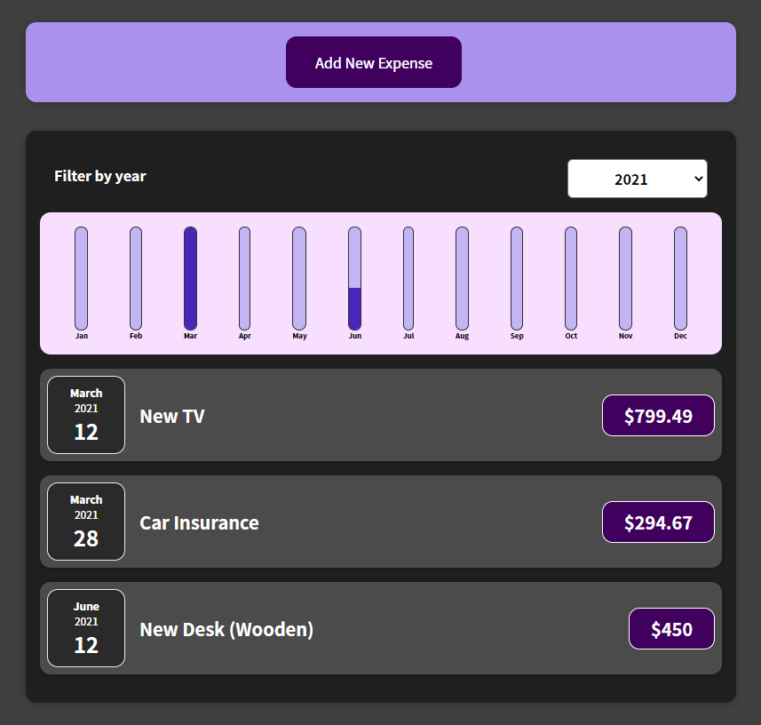

# **React - Expenses Tracker** - by Russell Oakham

## **Project overview**

Simple expenses tracker built using React JavaScript framework, to learn and practice basic React functionality and dynamic design.

Live app is deployed via firebase at below url:

<a href="https://react-task-manager-3ed3d.web.app/">React Expenses Tracker</a></li>

